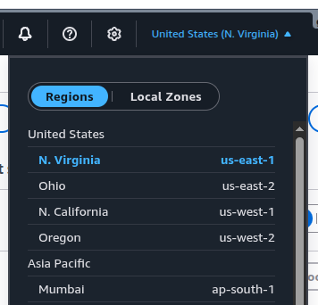
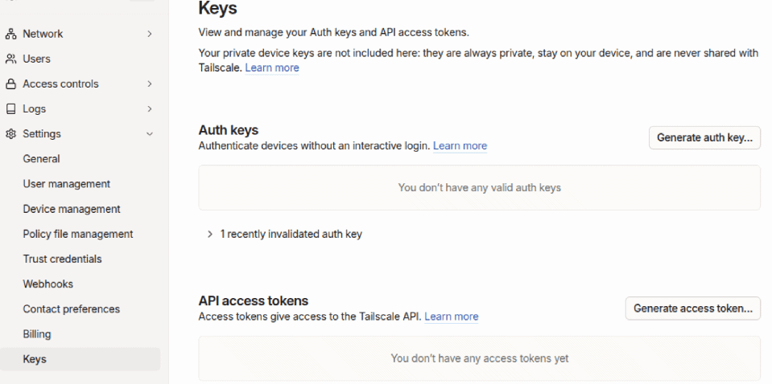

# Deployment Pre-requisites

1. **AWS CLI** configured with credentials (see next section)
2. **Tailscale auth key** — generate a ephemeral auth key at https://login.tailscale.com/admin/settings/keys. Make sure to set it as "reusable". Ephemeral keys have the benefits of removing the lambda node once it goes offline. If device approval is enabled, pre-approve the key.
3. **Docker** with buildx plugin — required to build the approve Lambda container image.
4. **Python 3** with `cryptography` package — required by the setup script to generate a Fernet key.

## AWS CLI configuration

To authenticate with aws in the aws-cli do the following:
- authenticate in your aws account as root user with your email and password
- open your terminal and run this to create a profile called admin `aws login --profile admin`
- enter the aws region closest to you (us-east-1, etc.)
- in your browser find the new aws tab opened and select the account you want to authenticate with

Your terminal will show "Updated profile default to use arn:aws:iam::<AWS_ACCOUNT_ID>:root credentials."

The region you entered is the geographical location where aws resources will be deployed. If you're having problem seeing your aws resources in the UI adjust the region to match the one you entered in your terminal. (_in the top header, in-between the settings icon and your profile name, click on the arrow down_).



Test the connection and save your account ID:
```bash
aws sts get-caller-identity --profile admin
ACCOUNT_ID=$(aws sts get-caller-identity --profile admin --query Account --output text)
```

To log out later simply run
> aws logout --profile admin

## Tailscale authentication key
At https://login.tailscale.com/admin/settings/keys
- click on _Generate auth key..._
- check Reusable
- check Ephemeral
- select the max duration (you will need to update this every 90 days)
- enter description
- click Generate key
Save the result for later



---

# Deployments steps

Run this every time you have been logged out of the aws cli. 
```bash
aws login --profile admin
ACCOUNT_ID=$(aws sts get-caller-identity --profile admin --query Account --output text)
```

# First-time deployment commands (RUN ONCE)
Login to AWS through the CLI if not done already
```bash
aws login --profile admin
```

Next we need to create a few resources manually.
- a deployer policy and role
- an S3 bucket to store the packaged code for the landing page/registration page lambda
- an ECR repo; build a docker image and push it to the ECR
- save to SSM Parameter Store the Tailscale auth key, the admin API key and an encryption key

Simply run the script below to take care of all this. I strongly recommend reading the explanation beneath.
```bash
./infrastructure-no-kms-ssm/first-deploy.sh
```

**Section I/II/III/IV below are already taken care by the script above.**

### I. Create a Cloudformation deployer role

It will be assumed by Cloudformation to deploy the stack. Note that this is optional and you can instead deploy using your admin profile which has all permissions in this case skip to ###4. .

**From the project root**, three steps:

#### 1. Create the role with CloudFormation as trusted service
```sh
aws iam create-role \
  --profile admin \
  --role-name home-cloud-deployer-role \
  --assume-role-policy-document '{
    "Version": "2012-10-17",
    "Statement": [
      {
        "Effect": "Allow",
        "Principal": {
          "Service": "cloudformation.amazonaws.com"
        },
        "Action": "sts:AssumeRole"
      }
    ]
  }'
```

#### 2. Create the managed policy from the file (upload it first, then run this from the same dir)
```sh
aws iam create-policy \
  --profile admin \
  --policy-name home-cloud-deployer-policy \
  --policy-document file://infrastructure-no-kms-ssm/deployer-policy.json
```
For update:
```sh
aws iam create-policy-version \
  --profile admin \
  --policy-arn arn:aws:iam::${ACCOUNT_ID}:policy/home-cloud-deployer-policy \
  --policy-document file://infrastructure-no-kms-ssm/deployer-policy.json \
  --set-as-default
```

#### 3. Attach the policy to the role (replace ACCOUNT_ID with yours)
```sh
aws iam attach-role-policy \
  --profile admin \
  --role-name home-cloud-deployer-role \
  --policy-arn arn:aws:iam::$ACCOUNT_ID:policy/home-cloud-deployer-policy
```

---

### II. Create the S3 bucket
Create an S3 bucket for your deployment.
> `HOME_CLOUD_DEPLOY_BUCKET=home-cloud-bucket`
> `aws s3 mb s3://$HOME_CLOUD_DEPLOY_BUCKET --profile admin`

You can always delete it later without breaking the registration page. If you decide to make an update you can simply re-create it.
> `aws s3 rb s3://$HOME_CLOUD_DEPLOY_BUCKET --profile admin`

---

### III. Create SSM Parameter Store SecureString parameters

The stack requires three SSM SecureString parameters that cannot be created by CloudFormation.
Run the setup script **before deploying the stack**:

```bash
./infrastructure-no-kms-ssm/setup-parameters.sh --profile admin
```

The script will:
1. **Auto-generate** a Fernet encryption key and store it in SSM
2. **Prompt** for your Tailscale auth key (`tskey-auth-...`)
3. **Prompt** for your admin API password

All three are stored as SSM SecureString parameters, encrypted with the AWS-managed `aws/ssm` key (free).

**Parameters created:**

| Parameter | Description |
|-----------|-------------|
| `/home-cloud/fernet-key` | Auto-generated Fernet key for token encryption |
| `/home-cloud/tailscale-auth-key` | Tailscale ephemeral auth key |
| `/home-cloud/admin-api-password` | Basic auth password for the registration API |

---

### IV. ECR commands
```bash
# Create an ECR (elastic container) repository
ECR_URI=$(aws ecr create-repository \
  --profile admin \
  --repository-name home-cloud-ecr-repo \
  --query 'repository.repositoryUri' \
  --output text)

# Authenticate Docker to ECR
aws ecr get-login-password --profile admin \
  | docker login --username AWS --password-stdin ${ECR_URI%%.com*}.com

# Build the image (must target linux/amd64 for Lambda)
docker buildx build --provenance=false \
  -t ${ECR_URI}:latest \
  -f infrastructure-no-kms-ssm/lambda-approve/Dockerfile \
  infrastructure-no-kms-ssm/lambda-approve/

# Push to ECR
docker push ${ECR_URI}:latest
```

If you ever need to update your ECR image you can repeat those steps beside the 1st one which becomes:
```bash
AWS_REGION=$(aws configure get region --profile admin 2>/dev/null || echo "us-east-1")
ECR_URI="${ACCOUNT_ID}.dkr.ecr.${AWS_REGION}.amazonaws.com/home-cloud-ecr-repo"
```

You must replace the AWS_REGION= with your own. You can also find the full string on aws at Amazon ECR > Private registry > Repositories
Make sure to remove the older image as well.

---

# Package the Register lambda code
The "Register" Lambda function’s code comprises of the main 'register.py' file containing the function’s handler code, python dependencies and the static HTML page. Cloudformation (cfn) cannot ship this all-at-once, we must first create a zip package, upload it and refenrence it in the cfn template.
_Note: when using the CLI only it is possible to pass the zip directly. _

The cloudformation package command zips the whole directory where the template lives, uploads that to S3 and finally creates a new template where the Register lambda config now includes Code.S3Bucket and Code.S3Key pointing to the uploaded zip file."

```bash
# Install python dependency required for the Register lambda function
mkdir -p infrastructure-no-kms-ssm/lambda-registration/packages
pip install "cryptography" --target infrastructure-no-kms-ssm/lambda-registration/packages/ --quiet
HOME_CLOUD_DEPLOY_BUCKET=home-cloud-bucket
aws cloudformation package \
  --template-file infrastructure-no-kms-ssm/template.yaml \
  --s3-bucket $HOME_CLOUD_DEPLOY_BUCKET \
  --output-template-file infrastructure-no-kms-ssm/packaged.yaml \
  --profile admin
rm -rf infrastructure-no-kms-ssm/lambda-registration/packages
```
Alternatively you can zip the registration lambda folder only, upload it and then update the lambda code. It requires having the template pointing to the static zip file in S3 and update the handler path.
```
# mkdir -p infrastructure-no-kms-ssm/lambda-registration/packages
# pip install "cryptography" --target infrastructure-no-kms-ssm/lambda-registration/packages/ --quiet
# cd infrastructure-no-kms-ssm/lambda-registration/ && zip -r ../registration.zip . && cd -
# aws s3 cp infrastructure-no-kms-ssm/registration.zip s3://${HOME_CLOUD_DEPLOY_BUCKET} --profile admin
# rm infrastructure-no-kms-ssm/registration.zip
# aws lambda update-function-code --profile admin --function-name home-cloud-registration-lambda --s3-bucket home-cloud-bucket --s3-key registration.zip
```
---

# Deploy

```bash
aws cloudformation deploy \
  --profile admin \
  --template-file infrastructure-no-kms-ssm/packaged.yaml \
  --stack-name home-cloud \
  --parameter-overrides \
    FromAdminEmail=admin@test.com \
    ToAdminEmail=admin2@test.com \
    ApproveApiBaseUrl=http://your-server:3000 \
    ApproveApiUsername=admin \
    Architecture=x86_64 \
  --capabilities CAPABILITY_IAM \
  --role-arn arn:aws:iam::$ACCOUNT_ID:role/home-cloud-deployer-role
```
Replace `admin@example.com` with your actual admin email. Architecture defaults to `x86_64` but you **must** set this to arm if you are building on an arm machine.

---

# Delete the stack
Simply run the script below to take care of all this.
```bash
./infrastructure-no-kms-ssm/delete-all-aws-resources.sh
```

---
